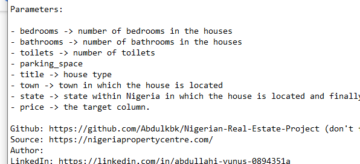

# -Nigeria-Housing-Analysis-Report
## NIGERIA REAL ESTATE PROJECT
This report is a dashboard about the housing system in Nigeria.  It contains data like the price of houses, type of houses, state, town, and the number of bedrooms, bathrooms, toilets and parking spaces.

___
## INTRODUCTION
Housing is one of the most important life components giving shelter, safety and warmth, as well as providing a place to rest. It has been estimated that about 85% of the urban population live in single rooms, often with eight to twelve persons per room. Living conditions are poor. 

## Data Sourcing
The dataset provides information about the type of house, the state they are located and the prices of a real estate company. The dataset was gotten from https://nigeriapropertycentre.com/

**_Disclaimer_**: _All datasets and reports do not represent any company, institution, or country, but just a sample dataset to practise 

## PROBLEM STATEMENT
1.	What is the total revenue by house type?
2.	What is the average price by each state?
3.	What is the total price by region?
4.	How many regions, states and towns are in the dataset?
5.	Using tables, illustrate the total number of bathrooms, toilets, bedrooms and parking spaces by house type.
6.	Using a Map, illustrate the average price by state.

 ## DATA CLEANING
 The data was cleaned, some states were not how they should be, they were renamed and a new column called Region was created to know the region of each state in the dataset.

## SKILLS DEMONSTRATED
Some of the skills used were;
-	Power query
-	Pivot tables
- Table
- Power pivot
- Data model to get distinct count
- Filters
- Slices
- Page navigation
- macros
- if function
- Concatenate
     Map           |      PowerPivot
  :-------------------------:|:--------------------------:
       |   

## Data Transformation
The data was cleaned, some states and towns were not properly named, they were renamed and a new column called Region was created to know the region of each state in the dataset.

## Visualization
The problem statement and other business questions were answered and illustrated using maps, line chart, and column chart. The dashboard can be found [here](https://docs.google.com/spreadsheets/d/1eOeeUB85Szh29GguPOhWvA9Q6VLU3rsv/edit?usp=drive_link&ouid=100550738749140141761&rtpof=true&sd=true)

## ANALYSIS
The average revenue is ₦301,380,208.5, there was a total of 6 region in 25 states and 189 towns in the dataset. We have 7 different house type in the dataset in which the most sold house type is detached duplex. South west region have the highest revenue with lagos being the first.
House type               | Cleaned Dataset               |  Data Dictionary
  :-------------------------:|:--------------------------:  | :------------------:
       |          |  
  
## CONCLUSION
1.	The average total revenue is ₦301,380,208.5
2.	We have a total of 189 towns in 25 states in 6 regions in the dataset.
3.	The South-west region has the highest revenue with Lagos being the first having an average revenue of ₦344,261,451.6
4.	Detached duplex has the highest revenue with terraced bungalow having the least
5.	Most blocked flats, detached bungalows, semi-detached bungalows and terraced bungalows have 3 bedrooms, bathrooms, toilets and parking spaces
6.	Most semi-detached duplex and terraced duplex have 4 bedrooms, bathrooms, toilets and parking spaces
7.	Most detached duplexes have 5 bedrooms, bathrooms, toilets and parking spaces
8.	The highest revenue was from houses with 5 bathrooms, 7 bedrooms, 8 toilets and 4 Parking spaces.
9.	Only terraced duplexes were sold in Northeast region of Nigeria

## RECOMMENDATION
- The North is known for its high population and has the least housing scheme, so more housing schemes should be available in the Northeast and West regions.
- There is a total of 36 States in Nigeria which only 25 states are represented in the dataset which shows how fictitious it is.
- More data needs to be collected to know how large a family is

